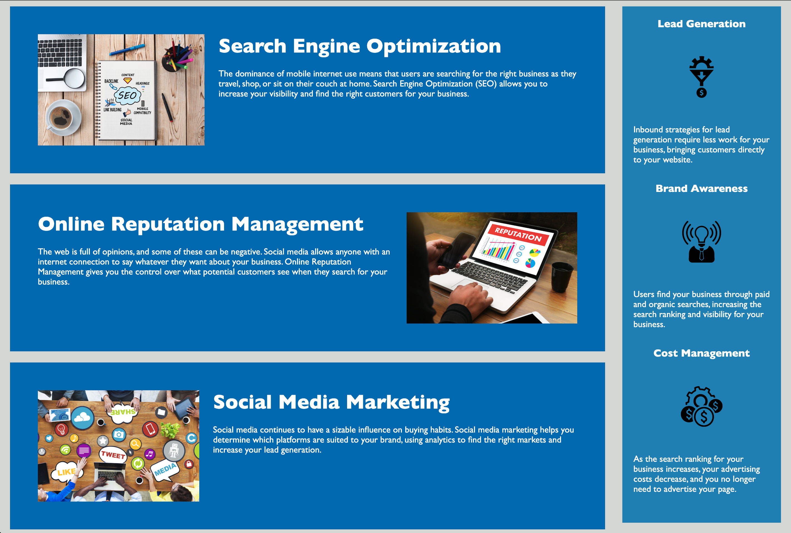

# Code Refactor Starter Code

# Horiseon Online Marketing Agency Webpage

## Description

- I refractored the code to meet the accessibility standards, which makes the existing site more accessible
- I did this in order to ensure that people with disabilities can access a website using assistive technologies such as video captions, screen readers, and braille keyboards.
- Making a website accessible is also good for business for many reasons, one of them being that accessible sites are better positioned in search engines like Google.
- It also helps companies avoid litigation that can occur when people with disabilities can't access their website.
- I learned how to refractor the code such that functions of all links are maintained. I also learned how to rework the CSS to make it more efficient by assigning CSS selectors and properties appropriately such that it follows the semantic structure of the HTML elements, and including comments before each element or section of the page.

## Installation

N/A

## Usage

- Users can use this website to learn about what services Horiseon, an online marketing agency, provides to improve the cient's business with marketing, which includes optimizing search engines, managing online reputation, and social media marketing.
- Tapping on the navigation bar on the top right will lead the useres directly to the description of the services they provide.
- The sidebar also includees marketing strategies such as lead generation, brand awareness, and cost management.
- All in all, users can utilize this website to learn about important marketing strategies and services Horiseon provides.

## Screenshot of the website

## Credits

N/A

## License

Please refer to the LICENSE in the repo.
